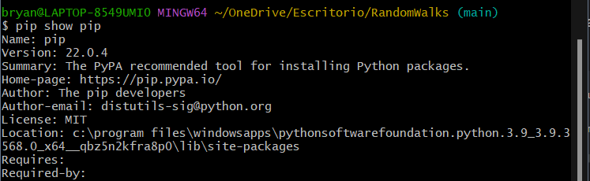

# Random walk simulator

This program simulate a random walk made by a frog jumping in 1, 2 and 3 dimensions.
Please follow these **steps** to be able to run the program and avoid future errors:

## Clone the Project

1. Go to your desktop or an empty folder and right-click to display the pop-up 
   menu where you will select the "Open Git Bash here" option. 
     
     

    

2. In the terminal, type the following command:

    `git clone https://github.com/brayooo/RandomWalks.git`
    And wait for it to finish cloning the entire project from the repository

3. When you finish cloning, the project folder should appear.

    

## Install required Python Libraries

If you are using windows you better use a **bash** terminal or if
you already have the configuration done of your windows cmd to works
with python, go ahead.

### Let's check that pip is installed
- Open a **bash** into the project and type:

    

      > pip show pip
    
    If you have it installed, you should see general information about this library. Like this:
    
    

    If nothing comes out, you must install pip.

    
- Install requirements:

      > pip -r install requirements.txt
    
    
    
    ### Now you're up to use the project.

## Running the Project

- Open the project with the **IDE** or **Development Environment** you want.
- You'll see three .py files.
  
    

- You can run any file with the command
      
      > python "fileName"

- Or you can run the file using the run configuration of your IDE.

Perfect, if everything goes well and if you followed the steps you can run all 
the simulations.

## Author

- Bryan Lopez

**Simulación de Computadores - Grupo 1**
